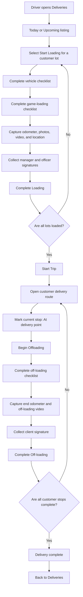

# Delivery Working Flow

This document describes the delivery workflow currently implemented in the Wildlife Transport driver app, from the delivery listing through final completion.

## End-to-end overview

## 1. Delivery listing

The **Deliveries** screen contains two tabs:

- **Today** loads active records from `GET driver-auth/schedule/today`.
- **Upcoming** loads active records from `GET driver-auth/schedule/upcoming`.
- **Completed** refreshes `GET driver-auth/schedule/today` and shows its
  completed records.

Each delivery card shows its schedule date/time, customer lots, customer contact and location information, and the current delivery stage:

1. **Loading** — one or more lots still need to be loaded.
2. **Ready** — every lot is loaded and the trip can start.
3. **In transit** — the trip has started and customer deliveries are in progress.
4. **Delivered** — every customer delivery is complete.

Pulling down on either listing refreshes the schedule. An authentication failure offers **Log in again**; other loading failures offer **Retry**.

## 2. Loading each lot

The driver must complete loading separately for every customer lot on a delivery card.

### Starting or resuming loading

- **Start Loading** calls `PATCH driver-auth/delivery/{deliveryId}/status` with
  `status: loading_in_progress`.
- If the driver leaves the workflow after loading has started, the listing displays **Continue Loading**.
- A loaded lot displays **Loading Completed** and cannot be loaded again.

### Required loading workflow

The driver completes four steps in order. Pages cannot be skipped by swiping.

#### Step 1 — Vehicle checklist

Every vehicle-safety and equipment checklist item must be selected before **Next** is enabled.

#### Step 2 — Game-loading checklist

Every game-loading checklist item must be selected before **Next** is enabled.

#### Step 3 — Photos and trip evidence

The following information is required:

- Start odometer reading.
- At least one vehicle photo.
- At least one animal photo.
- An animal video of up to 30 seconds.
- Current latitude and longitude captured while taking a photo.

Camera or location failures are shown to the driver, and the workflow cannot continue while required evidence is missing.

#### Step 4 — Signatures

Both signatures are required:

- Transport manager signature.
- Supervising officer signature.

Selecting **Complete Loading** first uploads the photos, video, and signatures. It then calls:

`POST driver-auth/delivery/{deliveryId}/start`

The request contains the uploaded file paths, odometer reading, coordinates, both checklists, and signature paths.

After the start payload succeeds, the app patches the status to
`loading_completed`, returns to the listing, and marks that lot as loaded. The
app records the loading order because customer off-loading is performed in
reverse loading order.

## 3. Starting the trip

The main delivery button remains disabled until all lots are loaded. Its label shows progress, for example:

`Load all lots to start trip (2/3 loaded)`

When every lot is ready, the button changes to **Start Trip**.

Selecting it:

1. Calls `PATCH driver-auth/delivery/{deliveryId}/status` with
   `status: in_delivery`.
2. Starts active-delivery location tracking.
3. Opens the **Customer Delivery** route screen.

If the status API request fails, the trip is not started and an error message
is displayed.

### Active-delivery location tracking

- Before the first tracked trip, the app explains that location is collected
  only while a delivery is active.
- The app captures an initial position and targets another reading every 30
  minutes while the vehicle is moving.
- Android uses a visible foreground-service notification during background
  tracking. iOS uses the Location Updates background mode.
- Operating-system scheduling and battery controls mean the 30-minute interval
  is best effort rather than exact.
- Readings are sent to
  `POST driver-auth/delivery/{deliveryId}/location` using the driver JWT.
- Failed readings are stored in an on-device queue and retried oldest-first.
- A banner shows whether tracking is active, the last successful upload, queued
  readings, and permission/network warnings.
- Tracking is restored when the schedule reloads with an active trip.
- Tracking stops when the final customer is completed or the driver logs out.

For a trip already in progress, the listing button reads **Continue Delivery**
and reopens the customer route without sending the status patch again.

## 4. Customer route and off-loading

The route screen shows:

- Completed stops versus total stops.
- A route progress bar.
- Stops numbered in delivery order.
- Customer, address, farm, company, contact, coordinates, navigation, and invoice information when available.

### Delivery order

For combined deliveries, customers are shown in reverse loading order. The last lot loaded is the first lot delivered.

Only one customer can be actively off-loaded at a time. Other customer buttons remain locked until the active customer's off-loading is finished.

### Arriving at a stop

Arrival uses two deliberate confirmations:

1. Select **At delivery point** to patch the status to `arrived_at_location`.
2. The active customer card displays **Store Customer Lat/Longs**.
3. Select **Begin Offloading** to patch the status to `offloading_started` and
   open the off-loading workflow.

### Storing the customer delivery pin

After arrival, the driver can select **Store Customer Lat/Longs**. The app:

1. Captures a high-accuracy GPS position.
2. Shows the coordinate and accuracy on an OpenStreetMap preview.
3. Requires confirmation before saving.
4. Warns when an existing customer pin will be replaced.
5. Calls
   `PUT driver-auth/delivery/{deliveryId}/customer-location` with the buyer ID,
   coordinates, accuracy, and UTC capture time.
6. Updates the customer card with the canonical coordinates returned by the
   backend.

Map-tile failure does not change the captured coordinate. The coordinate text
remains visible so it can still be confirmed. Customer-pin capture is optional
unless the backend/business workflow later makes it mandatory.

### Required off-loading workflow

#### Step 1 — Off-loading checklist

Every off-loading checklist item must be selected before continuing.

#### Step 2 — Video and odometer

The following are required:

- End odometer reading.
- A video recorded while animals are being off-loaded, up to 30 seconds.

At least one end-animal photo is required because the `/end` API requires
`endAnimalPhotos`. Location is not part of the end payload.

#### Step 3 — Client signature

The person accepting the animals must sign to confirm their health and quantities.

Selecting **Complete Off-loading** uploads the video and client signature, then calls:

`POST driver-auth/delivery/{deliveryId}/end`

The request contains end-animal photo paths, the `endAnimalVideos` path, the
completed checklist, signature path, end odometer reading, and buyer ID.

The endpoint changes the server status to `completed`. After success, the stop
is marked complete and the app returns to the delivery listing.

## 5. Completing the delivery

When the final customer is completed:

1. Route progress reaches the total number of stops.
2. The app displays **Delivery complete**.
3. The driver selects **Back to Deliveries**.
4. The route returns its updated lots to the listing.
5. The listing marks the parent delivery `completed` and displays **Delivery Completed**.

The completed delivery button is disabled, preventing the workflow from being repeated.

## Status transitions

| Scope | From | Action | To |
| --- | --- | --- | --- |
| Lot | `pending`/`ready` | Start Loading | `loading_in_progress` |
| Lot | `loading_in_progress` | Complete Loading | `loading_completed` |
| Parent delivery | Ready | Start Trip | `in_delivery` |
| Customer lot | `in_delivery` | At delivery point | `arrived_at_location` |
| Customer lot | `arrived_at_location` | Begin Offloading | `offloading_started` |
| Customer lot | `offloading_started` | Complete Off-loading | `completed` |
| Parent delivery | All lots completed | Return to listing | `completed` |

The app also accepts older API status variants such as `loading_started`,
`trip_started`, and `offloading_completed` when restoring an existing trip.

The mobile workflow uses only aggregate `/start`, aggregate `/end`, and direct
`/status` calls. It does not call the staged lifecycle endpoints.

## Failure and resume behavior

- API errors are displayed in a floating message and do not advance local state.
- Media uploads must finish successfully before loading or off-loading is completed.
- A lot in `loading` can be resumed from **Continue Loading**.
- A delivery in progress can be resumed from **Continue Delivery**.
- Pull-to-refresh reloads server state for the listing.
- Leaving the customer route returns the latest locally updated stop statuses to the listing.

## Important implementation note

The final parent-delivery completion is currently derived in the app after every customer lot reports completion. There is no separate parent-level “complete trip” API call in the current implementation.
