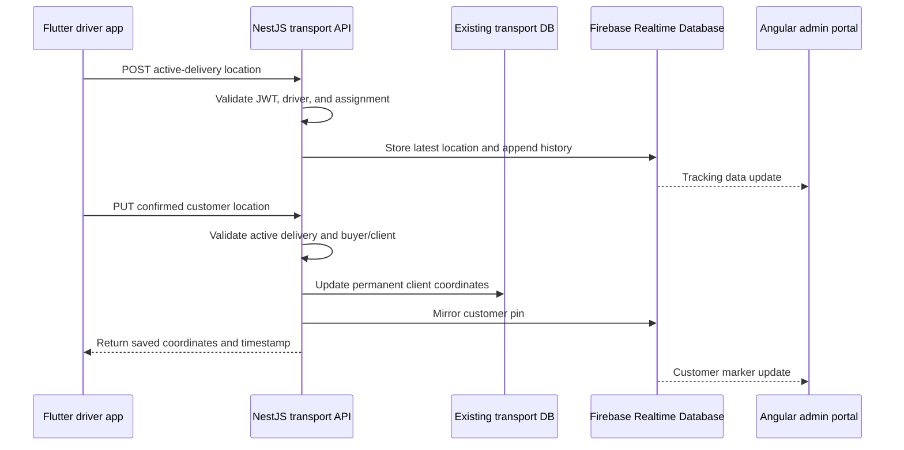

# Firebase Location Tracking Handoff

## Purpose

This document defines the work required to add driver tracking and customer
delivery pins to the Wildlife Transport system.

The feature has three parts:

1. The Flutter driver app captures the driver's position during an active trip
   and sends a reading approximately every 30 minutes.
2. At the customer location, the driver can capture and confirm the customer's
   delivery pin from the off-loading flow.
3. A protected Angular page hosted on the transport system displays active
   drivers, customer pins, and recorded trip history on OpenStreetMap.

The Firebase project is currently identified by the display name `wild`. The
backend team must confirm the actual Firebase project ID before setup.

## Ownership

| Area | Owner | Deliverable |
| --- | --- | --- |
| Driver location capture and customer-pin UI | Flutter team | Changes in this repository |
| Firebase Admin integration and API contracts | NestJS backend team | Secure endpoints and database writes |
| Client record persistence | NestJS backend team | Customer coordinates stored under the client record |
| Tracking map | Angular admin team | Protected tracking page hosted on the transport system |
| Firebase project, rules, IAM, and retention | Backend/infrastructure team | Production Firebase configuration |

No Firebase service-account key may be included in the Flutter or Angular
applications or committed to any repository.

## Agreed functional behaviour

### Driver tracking

- Tracking starts only after **Start Trip** succeeds and the delivery becomes
  `in_delivery`.
- Tracking stops when all customer deliveries are completed, the trip is
  cancelled, or the driver logs out.
- While the trip is active, the app attempts to capture and submit a position
  every 30 minutes.
- The 30-minute interval is a target. Android and iOS can delay background work
  because of battery optimisation, permissions, loss of signal, or an app being
  force-stopped.
- Each reading includes the delivery, driver, coordinates, accuracy, and the
  time recorded by the device. The backend adds the server-received time.
- If the device is offline, the Flutter app queues readings and retries them in
  recorded-time order when connectivity is restored.
- The backend rejects readings for a driver who is not assigned to the active
  delivery.

### Customer delivery pin

- The off-loading customer card contains a **Store Customer Lat/Longs** button.
- The button obtains the current high-accuracy GPS reading.
- The driver sees an OpenStreetMap preview, coordinates, and reported accuracy
  before confirming.
- Confirmation stores the coordinates on the permanent client record and
  mirrors the location into Firebase for tracking-map use.
- The UI shows that the pin was saved and when it was captured.
- A saved pin can be replaced only after an explicit confirmation.
- Customer-pin capture should initially be optional so a GPS failure does not
  block a delivery. Making it mandatory is a separate business decision.

### Tracking page

- The Angular tracking page is protected by the existing administrator login.
- It displays the latest driver location, customer pins, and the driver's
  timestamped trail for a selected delivery.
- It updates when a new reading reaches Firebase. Readings are expected about
  every 30 minutes.
- A driver marker is marked stale when no reading has arrived for 60 minutes.
- The page is hosted within the existing transport system, with `/tracking` as
  the proposed route.

## End-to-end data flow



## Firebase requirements

Firebase Realtime Database is recommended because this feature needs a simple
latest-value listener, append-only trip history, and low-frequency updates.

### Proposed paths

```text
tracking/
  active/{deliveryId}/{driverId}
    deliveryId
    driverId
    vehicleId
    latitude
    longitude
    accuracyMetres
    recordedAt
    receivedAt
    deliveryStatus

  history/{deliveryId}/{driverId}/{locationId}
    deliveryId
    driverId
    vehicleId
    latitude
    longitude
    accuracyMetres
    recordedAt
    receivedAt

customerLocations/{clientId}
  clientId
  buyerId
  deliveryId
  latitude
  longitude
  accuracyMetres
  capturedByDriverId
  capturedAt
  updatedAt
```

### Data rules

- Store coordinates as numbers, not strings.
- Latitude must be between `-90` and `90`.
- Longitude must be between `-180` and `180`.
- Accuracy must be non-negative.
- `recordedAt` is supplied by the device in UTC.
- `receivedAt` and `updatedAt` are server timestamps.
- Use a generated unique key for each history reading. Do not use the timestamp
  alone because delayed readings can share a time or arrive out of order.
- Update `tracking/active` only when the incoming reading is newer than the
  currently stored `recordedAt` value.
- Always retain accepted readings in `tracking/history`, even when a delayed
  reading is too old to replace the active marker.
- Recommended detailed-history retention is 90 days. Confirm this with the
  business and privacy owner.

### Security

- Use the Firebase Admin SDK only in the NestJS backend for writes.
- Store Admin credentials in the deployment secret manager or runtime identity.
- Do not place a service-account JSON file in source control.
- The Angular application must not have public/unrestricted database access.
- The backend team should choose one of these protected read patterns:

  1. Preferred: the Angular page reads tracking data through authenticated
     NestJS endpoints or a NestJS WebSocket/SSE channel.
  2. Alternative: NestJS mints a Firebase custom token for the authenticated
     administrator, and Firebase rules allow administrators read-only access.

- Public Firebase reads and writes must remain disabled.
- Log rejected tracking writes and customer-pin replacements for audit.

## NestJS backend requirements

The backend team owns all Firebase writes and permanent client updates. No
NestJS implementation is included in this repository.

### 1. Configure Firebase Admin

- Register the production project using the actual project ID for `wild`.
- Configure separate development/staging and production databases if both
  environments exist.
- Initialize Firebase Admin once in a shared NestJS module.
- Read project settings and credentials from environment/deployment secrets.
- Add a health check that verifies configuration without exposing credentials.

### 2. Add the driver-location endpoint

Proposed endpoint:

```http
POST /driver-auth/delivery/{deliveryId}/location
Authorization: Bearer <existing-driver-JWT>
Content-Type: application/json
```

Request:

```json
{
  "latitude": -25.7461,
  "longitude": 28.1881,
  "accuracyMetres": 12.4,
  "recordedAt": "2026-08-30T13:30:00.000Z"
}
```

Successful response:

```json
{
  "accepted": true,
  "locationId": "generated-location-id",
  "receivedAt": "2026-08-30T13:30:03.000Z"
}
```

Validation and behaviour:

- Authenticate using the existing driver JWT.
- Resolve the driver ID from the authenticated session; never accept it from
  the request body.
- Verify that the driver is assigned to the requested delivery.
- Accept readings only while the delivery is in an active trip state, including
  `in_delivery`, `arrived_at_location`, and `offloading_started`.
- Validate coordinate ranges, accuracy, and ISO-8601 UTC time.
- Reject implausibly future timestamps; allow delayed offline readings.
- Append the reading to Firebase history.
- Replace the active location only when the reading is newer.
- Return `401` for an invalid session, `403` for a wrong driver assignment,
  `404` for an unknown delivery, `409` for an inactive delivery, and `400` for
  invalid coordinates.
- Make retries idempotent. Prefer accepting a client-generated reading ID or
  deduplicating by driver, delivery, and recorded timestamp.

### 3. Add the customer-location endpoint

Proposed endpoint:

```http
PUT /driver-auth/delivery/{deliveryId}/customer-location
Authorization: Bearer <existing-driver-JWT>
Content-Type: application/json
```

Request:

```json
{
  "buyerId": "buyer-or-client-id",
  "latitude": -25.7512,
  "longitude": 28.1934,
  "accuracyMetres": 8.2,
  "capturedAt": "2026-08-30T14:05:00.000Z"
}
```

Successful response:

```json
{
  "clientId": "resolved-client-id",
  "buyerId": "buyer-or-client-id",
  "latitude": -25.7512,
  "longitude": 28.1934,
  "accuracyMetres": 8.2,
  "capturedAt": "2026-08-30T14:05:00.000Z",
  "updatedAt": "2026-08-30T14:05:02.000Z"
}
```

Validation and behaviour:

- Authenticate the driver and verify the delivery assignment.
- Verify that the buyer belongs to the delivery, including combined deliveries.
- Resolve the buyer to the permanent client record.
- Store these fields under the client record:
  `clientLatitude`, `clientLongitude`, `locationAccuracyMetres`,
  `locationCapturedAt`, `locationCapturedByDriverId`, and
  `locationSource` with value `driver_offloading`.
- Mirror the confirmed value to `customerLocations/{clientId}` in Firebase.
- Return the canonical saved location.
- Record old and new coordinate values in the backend audit log when replacing
  an existing pin.
- A retry with the same captured data must not create duplicate audit events.

The existing Swagger currently exposes coordinates on buyer-delivery DTOs but
does not document an operation that persists them to the permanent client
record. The new endpoint must be added to the Swagger/OpenAPI document.

### 4. Add protected tracking reads

If the Angular portal reads through NestJS, provide:

```http
GET /tracking/active
GET /tracking/deliveries/{deliveryId}
GET /tracking/deliveries/{deliveryId}/history
```

Requirements:

- Restrict all routes to authenticated administrator/dispatcher roles.
- Return active delivery, driver, vehicle, latest position, customer pins, and
  last-update timestamps.
- Allow history filtering by UTC `from` and `to` times.
- Paginate or cap large history responses.
- Provide SSE or WebSocket updates if the page should update immediately;
  otherwise a 30-minute page poll is acceptable.
- Do not expose unrelated drivers or historical data to normal driver users.

### 5. Completion and cleanup

- When a delivery completes, remove or mark its `tracking/active` record as
  completed without deleting its history.
- If a delivery is put on hold, preserve its latest marker but expose the hold
  state to the portal.
- Add a scheduled retention job for expired history.
- Ensure completion cleanup is idempotent.

### 6. Backend acceptance criteria

- An assigned driver can submit a valid reading for an active trip.
- Another driver cannot submit a reading for that trip.
- Offline/delayed readings are retained but cannot move the active marker
  backwards in time.
- Customer coordinates are saved under the correct client for main and combined
  buyers.
- Firebase and the permanent client record contain the confirmed customer pin.
- Admin tracking reads are protected by role.
- Endpoints, DTOs, responses, and error codes appear in Swagger.
- Unit and integration tests cover validation, authorization, idempotency,
  delayed readings, combined buyers, and Firebase failures.

## Angular admin portal requirements

The Angular team owns the tracking interface and its deployment within the
transport system. No Angular implementation is included in this repository.

### Route and access

- Add a protected `/tracking` route to the existing portal.
- Add a **Driver Tracking** navigation item for allowed roles.
- Reuse existing portal authentication and authorization guards.
- Redirect unauthenticated users to login and show an access-denied page for
  users without tracking permission.

### Page layout

- Delivery selector/filter with active deliveries first.
- Optional driver and vehicle filters.
- OpenStreetMap map occupying the main page area.
- Side panel or bottom sheet containing:
  - Delivery/auction reference.
  - Driver name.
  - Vehicle registration.
  - Delivery status.
  - Latest position time.
  - GPS accuracy.
  - Customer stop list and completion status.
- Visible legend for driver, customer, completed customer, and stale markers.

### Map behaviour

- Show the latest driver position as the primary marker.
- Show every available customer location for the selected delivery.
- Draw the driver trail in recorded-time order.
- Selecting a marker opens its details and timestamp.
- Fit the map to the relevant markers on initial load.
- Do not automatically reset zoom while the dispatcher is interacting with the
  map.
- Mark a driver stale after 60 minutes without a new reading.
- Show **Location not yet available** rather than using `(0, 0)`.
- Allow the dispatcher to refresh manually.
- Update automatically from SSE/WebSocket/Firebase listener, or poll the backend
  at the interval agreed with the backend team.

### OpenStreetMap requirements

- Use an Angular-compatible map library such as Leaflet.
- Keep the tile URL configurable by environment.
- Use HTTPS tile URLs.
- Display `© OpenStreetMap contributors` attribution on the map at all times.
- Do not bulk-download or prefetch tiles.
- Respect provider caching and identification requirements.
- For production, select an OSM-derived tile provider with suitable capacity and
  service terms, or self-host tiles. The community `tile.openstreetmap.org`
  service has no availability SLA.

### Error and empty states

- No active deliveries.
- Delivery has no driver location yet.
- Customer pin has not been captured.
- Driver location is stale.
- Tracking service is temporarily unavailable.
- User is not authorised.
- History is partially available or outside retention.

### Angular acceptance criteria

- Only authorised portal users can open `/tracking` or retrieve its data.
- The latest driver marker and update time match Firebase/backend data.
- Customer markers match the client locations saved by the driver.
- History is ordered and displayed as a route trail.
- Stale and missing-location states are visually distinct.
- OpenStreetMap attribution is always visible.
- The page works at supported desktop and tablet sizes.
- Component, service, route-guard, map-state, and error-state tests pass.

## Flutter driver app requirements

The Flutter changes belong in this repository. They must be developed against
the NestJS API contracts above; Firebase Admin credentials are not required in
the app.

### Existing integration points

- Trip start is handled from the delivery workflow when the server status is
  changed to `in_delivery`.
- Customer route and arrival actions are in
  `lib/features/delivery/screens/trip_customers_screen.dart`.
- The off-loading workflow is opened through
  `lib/features/delivery/screens/start_delivery/start_delivery_screen.dart`.
- Current one-time location handling is in
  `lib/core/location/current_location.dart`.
- Delivery requests are implemented through the delivery repository and
  `lib/features/delivery/data/delivery_remote_data_source.dart`.
- Client coordinates already flow through `DeliveryLot` and
  `DeliveryScheduleDto`.

### Required Flutter work

#### API and domain layer

- Add typed requests/responses for driver readings and saved customer pins.
- Add repository methods for the two new driver-auth endpoints.
- Map validation, authorization, inactive-trip, and network errors to clear
  driver-facing messages.
- Extend `DeliveryLot.copyWith` so confirmed latitude and longitude can replace
  values in local state.
- Parse the canonical saved customer coordinates returned by the backend.

#### Tracking lifecycle

- Add a trip-tracking coordinator/service independent of screen lifecycle.
- Start it only after the `in_delivery` status request succeeds.
- Restore it on app launch when the authenticated driver's schedule contains an
  active in-delivery trip.
- Stop it after the final customer is completed or the session ends.
- Ensure repeated resume/start events do not create multiple timers/services.
- Capture high-enough accuracy for transport tracking without continuously using
  maximum GPS power.
- Target one reading every 30 minutes.
- Include device-recorded UTC time and accuracy.
- Persist an offline queue locally and retry oldest-first.
- Assign a stable client-generated ID to each queued reading for idempotent
  retries.
- Keep failed readings until accepted or explicitly classified as permanently
  invalid.

#### Platform permissions and background execution

- Android:
  - Add background location permission when required by the target SDK.
  - Provide a clear permission rationale.
  - Use a foreground service with a visible **Active delivery tracking**
    notification if needed for reliable active-trip updates.
  - Declare the correct location foreground-service type and permissions.
- iOS:
  - Add an Always/background location usage description appropriate to active
    delivery tracking.
  - Enable the Location Updates background mode.
  - Show an in-app explanation before the system permission prompt.
- Tracking must still work in foreground-only mode when background permission is
  refused, while clearly warning the driver that background updates will pause.
- Do not track before trip start or after trip completion.

The maintained Flutter package for background location should be selected only
after checking compatibility with the repository's Flutter/Dart and Android/iOS
versions. A small platform proof-of-concept should precede the full workflow.

#### Customer-pin UI

- Add **Store Customer Lat/Longs** to the relevant customer/off-loading card.
- Disable it while capture or save is running.
- Capture current high-accuracy coordinates and accuracy.
- Show a confirmation view containing an OpenStreetMap preview, coordinates,
  accuracy, and **Save**/**Cancel** actions.
- If a pin already exists, change the action to **Update Customer Location** and
  explain that the old location will be replaced.
- Submit the buyer ID belonging to the selected customer lot.
- On success, update local lot coordinates and show a saved confirmation.
- On failure, keep the existing coordinates and allow retry.
- Never silently replace a saved pin.

#### OpenStreetMap in Flutter

- Use a maintained Flutter OpenStreetMap-compatible map package.
- Make the tile provider URL configurable.
- Display mandatory OpenStreetMap/provider attribution.
- Do not implement offline tile prefetching against the community tile server.
- Show a plain coordinate confirmation fallback if tiles cannot load; saving the
  GPS coordinate should not depend on map-tile availability.

#### Driver visibility and privacy

- Show a persistent in-app indicator while tracking is active.
- Explain that location is collected only during an active delivery.
- Show the last successful upload time and pending offline-reading count.
- Provide a way to open the OS location settings when permission is insufficient.
- Do not display Firebase or backend secrets in logs.

### Flutter tests

- Tracking starts after a successful trip start and not after a failed start.
- Restoring an active schedule starts exactly one tracker.
- Completing the final customer stops tracking.
- A 30-minute tick submits one valid reading.
- Offline readings are queued and later retried in order.
- Duplicate retries use the same client reading ID.
- Invalid/low-quality location handling is visible and does not crash the app.
- Customer-pin capture uses the selected lot's buyer and delivery IDs.
- Existing coordinates require replacement confirmation.
- A successful response updates the displayed coordinates.
- A failed response preserves the old coordinates.
- Permission-denied and background-permission-denied flows are covered.
- Existing delivery, loading, and off-loading tests remain green.

## Delivery order and dependencies

1. Backend team confirms the Firebase project ID, client-ID mapping, endpoint
   contracts, and retention.
2. Backend team implements Firebase Admin setup and both mobile endpoints in a
   development/staging environment.
3. Flutter team implements customer-pin capture against the staging endpoint.
4. Flutter team completes and device-tests active-trip background tracking.
5. Backend team supplies protected tracking reads or an administrator Firebase
   token flow.
6. Angular team implements and hosts `/tracking` with OpenStreetMap.
7. All teams run an end-to-end trip with multiple combined buyers, an offline
   period, and at least one customer-pin replacement.
8. Security, retention, privacy messaging, HTTPS, and production monitoring are
   verified before release.

The Flutter work depends on the final endpoint contracts. Mock implementations
can be used for UI and unit tests, but production integration cannot be completed
until the NestJS endpoints are deployed.

## Decisions still required

- Actual Firebase project ID for the project named `wild`.
- Exact mapping between API `buyerId` and the permanent client record ID.
- Whether customer-pin capture is optional or mandatory before off-loading.
- Confirmed tracking-history retention period; proposed default is 90 days.
- Whether Angular reads through NestJS, SSE/WebSocket, or Firebase custom auth.
- Production OSM-derived tile provider.
- HTTPS production URL and final tracking-page route.
- Supported Android and iOS minimum versions for background-tracking testing.

## Definition of done

The feature is complete when an assigned driver can start a trip, generate
location readings approximately every 30 minutes during that trip, capture a
confirmed pin for each customer, and complete the trip; customer pins are stored
under the permanent client records; Firebase contains the latest positions and
history; authorised dispatchers can view the data on the hosted OpenStreetMap
tracking page; offline, permission, stale-location, and unauthorised scenarios
are handled; and all three teams' automated and end-to-end tests pass.
